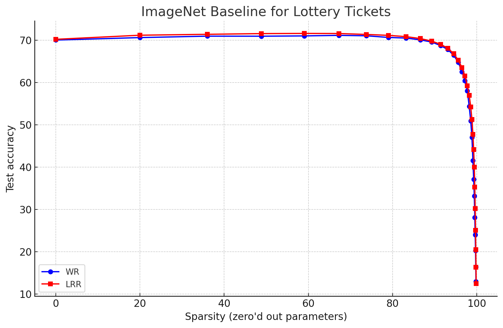
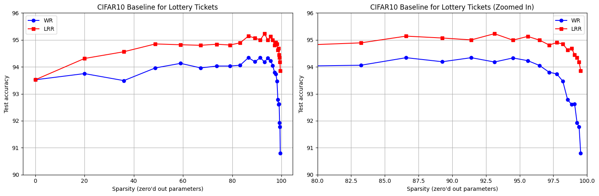

## Finding Lottery Tickets in Deep Neural Networks (+ Distributed Training)

In this repository, we implement a training harness which enables finding lottery tickets in deep CNNs on ImageNet and CIFAR datasets. The hope is this is able to make pruning research easier/faster :)!

### Key Features
- PyTorch Distributed Data Parallel (DDP) based training harness for training the network (post-pruning) as fast as possible.
- [FFCV](https://github.com/libffcv/ffcv) integration for super-fast training on ImageNet (1:09 mins/epoch on 4xA100 GPUs with ResNet18).
- Support for most (if not all) torchvision models. (Transformers will be added later).
- Multiple pruning techniques, listed below.
- Simple harness, with fastargs -- easily extensible.
- Logging to CSV (nothing fancy, but you can integrate wandb/comet/your own system easily).
- End to End pipeline easily configurarable using [fastargs](https://github.com/GuillaumeLeclerc/fastargs).

### Datasets Supported
1. CIFAR10
2. CIFAR100
3. ImageNet
4. SVHN (to be added)

### Networks supported
As it stands, ResNets, VGG variants should work out of the box. If you run into issues with any other variant happy to look into.

### Pruning Algorithms included:
1. **Iterative Magnitude Pruning (IMP)** from [The Lottery Ticket Hypothesis: Finding Sparse, Trainable Neural Networks](https://arxiv.org/abs/1803.03635)
3. **IMP with Weight Rewinding (IMP + WR)** from [Stabilizing the lottery ticket hypothesis](https://arxiv.org/abs/1903.01611)
4. **IMP with Learning Rate Rewinding (IMP + LRR)** [Comparing Rewinding and Fine-tuning in Neural Network Pruning](https://arxiv.org/abs/2003.02389)
5. **SNIP:** from [SNIP: Single-shot Network Pruning based on Connection Sensitivity](https://arxiv.org/abs/1810.02340)
6. **SynFlow:** [Pruning neural networks without any data by iteratively conserving synaptic flow](https://arxiv.org/abs/2006.05467)
7. **Random Balanced/ERK Pruning** from [Why Random Pruning Is All We Need to Start Sparse](https://proceedings.mlr.press/v202/gadhikar23a/gadhikar23a.pdf)
8. **Random Pruning** from [The Unreasonable Effectiveness of Random Pruning: Return of the Most Naive Baseline for Sparse Training](https://openreview.net/pdf?id=VBZJ_3tz-t)

### Repository structure:
1. **harness.py**: contains the training harness for actually training the network, has the requisite setup for DDP.
2. **harness_params.py**: Provides the parameters to be provided via config (fastargs), they are defined here. Please refer to the code, or [documentation]() for usage directions.
3. **harness_utils.py**: contains methods used for rewinding the weights, optimizer and other nice things we need to make this training work.
4. **utils/conv_type**: has the layers definitions and the model pre-processing function to insert the mask parameters as a buffer into those layers. This is what you probably want to edit for adding support for > insert custom SOTA architecture here.
5. **utils/dataset.py**: definiton for CIFAR10/CIFAR100, DDP or otherwise.
6. **utils/schedulers.py**: learning rate schedulers, for when you need to use them. The default config has what works best.
7. **utils/pruning_utils.py**: Pruning harness.
 
- Pruning within the training harness itself is not very stable w.r.t DDP and probably not the right way (also the harness is supposed to just train the network anyway). 
- This file contains all the criterion we use for pruning (those in the previous section) and a pruning harness to prune before you train :) -- hopefully this is useful. 
- Pruning harness can be called at the beginning for 
    - Pruning at Initialization (PaI),
    - one-shot pruning or
    - At each level for an iterative method.
    - Where necessary, it will use a GPU/Dataset.

8. **utils/single_gpu_harness.py** - without all the fancy DDP stuff, straightforward and simple.

### Important Pre-requisites
- To run ImageNet experiments, you obviously need ImageNet downloaded -- in addition, since we use FFCV, you would need to generate .beton files as per the instructions [here](https://github.com/libffcv/ffcv-imagenet).
- CIFAR10, CIFAR100 and other stuff are handled directly where possible -- thank you torchvision!

### Usage

Now to the important (fun part)

To start an experiment, ensure there is appropriate (sufficient) compute (or it might take a while -- its going to anyway)

```bash
pip install -r requirements.txt
python harness.py --config configs/resnet18_lrr_imagenet.yaml
```

and it should start :)

### ImageNet Baselines


### CIFAR10 Baselines


If you use this code in your research, and find it useful in general -- please consider citing using:
```
@software{Nelaturu_TurboPrune_High-Speed_Distributed,
author = {Nelaturu, Sree Harsha and Gadhikar, Advait and Burkholz, Rebekka},
license = {Apache-2.0},
title = {{TurboPrune: High-Speed  Distributed Lottery Ticket Training}},
url = {https://github.com/nelaturuharsha/TurboPrune}}
```


----------------
#### Footnotes and Acknowledgments:
- This code is built using references to the substantial hard work put in by [Advait Gadhikar](https://advaitgadhikar.github.io/).
-  Thank you to [Dr. Rebekka Burkholz](https://cispa.de/de/people/c01rebu) for the opportunity to build this :)
-  I  was heavily influenced by the code style [here](https://github.com/libffcv/ffcv-imagenet). Just a general thanks and shout-out to the FFCV team for all they've done!

All credit/references for the original methods are due to the original authors of the work :)
